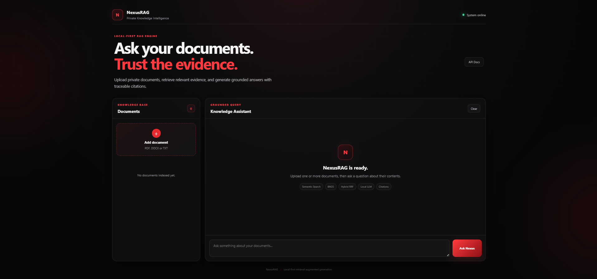
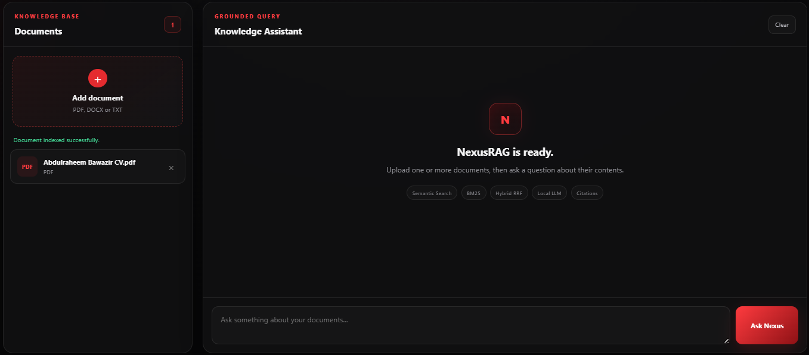
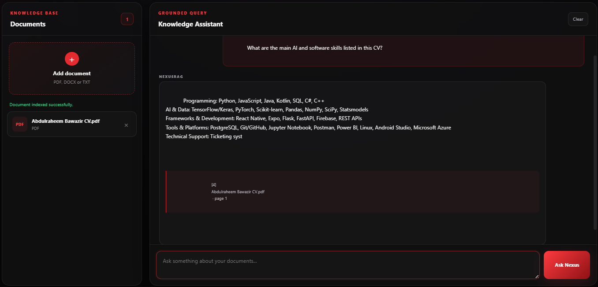
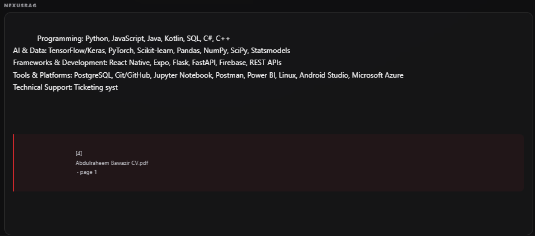
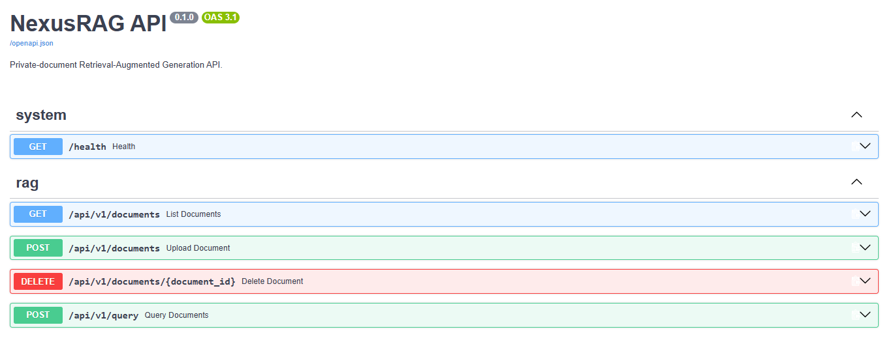
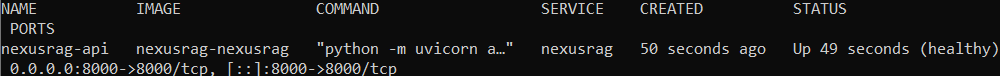

# NexusRAG

> A production-style, local-first Retrieval-Augmented Generation system for private document knowledge bases.

NexusRAG is an AI engineering portfolio project that implements the major components of a modern RAG system explicitly rather than hiding the pipeline behind a high-level framework.

It supports private PDF, DOCX, and TXT knowledge bases, local embeddings, persistent vector storage, semantic and lexical retrieval, hybrid ranking, grounded local LLM generation, traceable citations, evaluation, REST APIs, MCP tools, Docker, CI, observability, and a user-facing web interface.

The project is designed to demonstrate practical AI engineering across the entire lifecycle:

```text
Documents
   ->
Ingestion
   ->
Chunking
   ->
Embeddings
   ->
Vector Storage
   ->
Hybrid Retrieval
   ->
Grounded Generation
   ->
Citations
   ->
Evaluation
   ->
API / MCP / Web UI
   ->
Docker / CI
```

---

## Current Status

NexusRAG is functionally complete as a local-first RAG application.

Verified project status:

```text
Python tests:      179 passed
Ruff:              All checks passed
Local LLM:         Qwen3 4B through Ollama
Embedding model:   sentence-transformers/all-MiniLM-L6-v2
Vector store:      ChromaDB
Lexical search:    BM25
Hybrid fusion:     Reciprocal Rank Fusion
API:               FastAPI
MCP:               MCP Python SDK 2.x
Containerization:  Docker + Docker Compose
CI:                GitHub Actions
```

A real retrieval verification set currently contains four queries.

Measured results on that verification set:

```text
Evaluation cases: 4
Hit Rate@3:       1.0
Recall@3:         1.0
MRR:              1.0
```

These numbers describe only the current four-query verification set. They are not presented as overall system accuracy.

---

# Demo

The application provides a dark red / black user interface for private-document question answering.

Typical workflow:

```text
Upload document
      |
      v
Document indexed
      |
      v
Ask a question
      |
      v
Hybrid retrieval
      |
      v
Grounded local LLM answer
      |
      v
Source + page citation
```

Example verified behavior:

```text
Question:
What are the listed skills?

Answer:
Retrieved from the uploaded CV.

Citation:
Abdulraheem Bawazir CV.pdf
page 1
```

## Screenshots

### NexusRAG Interface



### Document Upload



### Grounded Answer



### Traceable Citation



### FastAPI / Swagger



### Docker Deployment



---

# Why NexusRAG?

Many introductory RAG projects reduce the architecture to something like:

```python
rag = Framework(...)
rag.chat("question")
```

That is useful for rapid prototyping, but it hides many of the engineering decisions that determine whether a RAG application is reliable.

NexusRAG instead exposes the core components individually.

```text
documents
    |
    v
normalized documents
    |
    v
chunks
    |
    v
embeddings
    |
    v
vector index
    |
    +----------------------+
    |                      |
    v                      v
semantic search         BM25
    |                      |
    +----------+-----------+
               |
               v
       reciprocal rank fusion
               |
               v
          reranking layer
               |
               v
        retrieved evidence
               |
               v
        grounded local LLM
               |
               v
        answer + citations
```

This makes the following engineering decisions visible and testable:

- document parsing
- chunk boundaries
- metadata propagation
- deterministic chunk identity
- embedding provider selection
- vector-store persistence
- semantic similarity
- keyword retrieval
- retrieval fusion
- thresholds and filters
- context construction
- grounded prompting
- structured LLM output
- citation validation
- unsupported-question behavior
- retrieval evaluation
- API design
- MCP integration
- containerization
- CI
- observability

---

# High-Level Architecture

```text
                     NexusRAG

                 User Documents
             PDF / DOCX / TXT
                       |
                       v
              Document Ingestion
                       |
                       v
              Normalized Document
                       |
                       v
                    Chunking
                       |
                       v
                  Chunk Objects
                       |
           +-----------+-----------+
           |                       |
           v                       v
   MiniLM Embeddings          BM25 Corpus
           |                       |
           v                       |
        ChromaDB                    |
           |                       |
           v                       |
   Semantic Retrieval              |
           |                       |
           +-----------+-----------+
                       |
                       v
          Reciprocal Rank Fusion
                       |
                       v
              Reranker Interface
                       |
                       v
              Retrieved Evidence
                       |
                       v
               Context Builder
                       |
                       v
              Grounded Prompt
                       |
                       v
              Qwen3 via Ollama
                       |
                       v
            Structured JSON Output
                       |
                       v
              Citation Validation
                       |
                       v
              Grounded RAG Answer
                       |
          +------------+-------------+
          |            |             |
          v            v             v
       FastAPI         MCP         Web UI
          |
          v
        Docker
```

For more detail, see:

```text
docs/ARCHITECTURE.md
```

---

# Document Ingestion

NexusRAG supports:

```text
PDF
DOCX
TXT
```

All formats are converted into a common internal `Document` representation.

Conceptually:

```python
Document(
    id="...",
    text="...",
    source="handbook.pdf",
    file_type="pdf",
    metadata={
        "page_number": 14,
        "source_id": "...",
        "source_path": "...",
    },
)
```

## TXT

TXT files support UTF-8 and UTF-8 BOM handling.

```text
example.txt
    |
    v
TXT Loader
    |
    v
Document
```

## DOCX

DOCX parsing uses `python-docx`.

Meaningful text is extracted while empty paragraphs are ignored.

## PDF

PDF parsing uses `pypdf`.

PDF content remains page-aware so page information can survive the entire RAG pipeline.

```text
handbook.pdf
     |
     +-- Page 1 -> Document
     +-- Page 2 -> Document
     +-- Page 3 -> Document
     +-- ...
```

This enables citations such as:

```text
handbook.pdf
page 14
```

Scanned image-only PDFs are not currently processed with OCR.

---

# Unified Loader

NexusRAG exposes a common loader interface:

```python
from app.rag.loaders.document_loader import load_document

documents = load_document("data/raw/example.pdf")
```

Output:

```python
list[Document]
```

Conceptually:

```text
TXT  ----\
DOCX -----+--> load_document() --> list[Document]
PDF  ----/
```

---

# Chunking

Documents are transformed into retrieval-ready chunks.

Implemented functionality includes:

- configurable character chunk size
- configurable overlap
- deterministic chunk IDs
- sequential chunk indexes
- source propagation
- file-type propagation
- metadata propagation
- deep-copy metadata isolation
- edge-case validation

Chunk identity is derived deterministically from:

```text
document ID
+
chunk index
+
chunk text
```

using SHA-256.

This supports stable, duplicate-safe indexing.

---

# Embeddings

NexusRAG uses a replaceable embedding-provider abstraction.

Current implementation:

```text
sentence-transformers/all-MiniLM-L6-v2
```

Verified embedding dimension:

```text
384
```

Characteristics:

```text
Execution:        local
Paid API:         not required
Batch embedding:  supported
Normalization:    supported
```

Pipeline:

```text
Chunk
  |
  v
MiniLM
  |
  v
384-dimensional vector
  |
  v
EmbeddedChunk
```

---

# Vector Storage

NexusRAG currently uses ChromaDB for persistent local vector storage.

Implemented operations include:

- upsert
- similarity query
- persistent collections
- chunk deletion
- document-level deletion
- collection clearing
- metadata filtering
- duplicate-safe re-indexing
- source preservation
- metadata preservation

---

# Semantic Retrieval

The semantic retriever performs:

```text
question
   |
   v
query embedding
   |
   v
Chroma similarity search
   |
   v
distance filtering
   |
   v
typed retrieval results
```

Supported controls include:

- `top_k`
- maximum semantic distance
- document filter
- source filter
- file-type filter

A real verification query:

```text
Can employees work from home?
```

successfully retrieves evidence containing:

```text
Employees may work remotely...
```

despite the wording being different.

---

# BM25 Keyword Retrieval

NexusRAG also includes BM25 lexical retrieval using:

```text
rank-bm25
```

Keyword retrieval is useful for:

- IDs
- error codes
- policy codes
- acronyms
- technical terminology
- exact names

For example:

```text
TRV-8842
```

can be matched directly through BM25.

---

# Hybrid Retrieval

Semantic and lexical retrieval are combined using Reciprocal Rank Fusion.

```text
Semantic Search
       |
       +---------+
                 |
                 v
                RRF
                 ^
                 |
       +---------+
       |
      BM25
```

Raw Chroma distance and BM25 scores are not directly added because they exist on different numerical scales.

RRF instead combines ranking positions.

---

# Reranking

NexusRAG includes a pluggable reranker interface.

Current implementation:

```text
NoOpReranker
```

This preserves the hybrid ranking while keeping the architecture ready for a learned local cross-encoder later.

A learned reranker is not currently claimed as an implemented capability.

---

# Grounded Generation

Retrieved evidence is passed through:

```text
Hybrid Results
      |
      v
Context Builder
      |
      v
Numbered Evidence Blocks
      |
      v
Grounded Prompt
      |
      v
Qwen3 4B
      |
      v
Structured JSON
```

The current local LLM runs through Ollama:

```text
qwen3:4b
```

NexusRAG explicitly requests structured output containing:

```json
{
  "answer": "Grounded answer",
  "citations": [1],
  "insufficient_evidence": false
}
```

The application then validates the result rather than trusting arbitrary model output.

---

# Citation Validation

Citations are connected back to retrieved chunks.

Each citation preserves information such as:

```text
citation index
chunk ID
document ID
source
file type
metadata
page number when available
```

The generation service rejects citations pointing to unavailable evidence indexes.

Grounded answers must contain at least one valid citation.

---

# Unsupported Questions

NexusRAG includes insufficient-evidence behavior.

If there is not enough retrieved evidence, the system can return:

```text
I don't have enough evidence in the indexed documents to answer that question.
```

with:

```text
citations = []
insufficient_evidence = true
```

This behavior is explicitly tested.

---

# Evaluation

NexusRAG contains evaluation utilities for:

## Retrieval

- Hit Rate@K
- Recall@K
- Mean Reciprocal Rank

## Citations

- citation precision
- citation recall
- citation F1

## Guardrails

- supported answers require evidence
- unsupported answers require insufficient-evidence behavior
- unsupported answers should not contain citations

Current real retrieval verification:

```text
Cases:       4
Hit Rate@3:  1.0
Recall@3:    1.0
MRR:         1.0
```

The benchmark intentionally remains identified as a small verification set rather than a large-scale accuracy benchmark.

Run it with:

```bash
python scripts/verify_retrieval_evaluation.py
```

---

# FastAPI

NexusRAG exposes a REST API through FastAPI.

Main endpoints:

```text
GET     /health

POST    /api/v1/documents
GET     /api/v1/documents
DELETE  /api/v1/documents/{document_id}

POST    /api/v1/query
```

Swagger documentation:

```text
http://localhost:8000/docs
```

OpenAPI schema:

```text
http://localhost:8000/openapi.json
```

---

# MCP

NexusRAG exposes private-document capabilities through the Model Context Protocol using the MCP Python SDK 2.x.

Implemented MCP tools:

```text
list_documents
search_documents
ask_documents
```

Run the stdio MCP server:

```bash
python -m app.mcp.server
```

The process waits for an MCP client over standard input/output.

---

# Web Interface

NexusRAG includes a user-facing interface served directly by FastAPI.

Features:

- red / black visual theme
- system health indicator
- PDF upload
- DOCX upload
- TXT upload
- indexed-document list
- document deletion
- grounded question answering
- source citations
- page-number display
- API documentation link

Run locally:

```bash
python -m uvicorn app.main:app --reload
```

Then open:

```text
http://127.0.0.1:8000
```

---

# Docker

NexusRAG is containerized using Docker.

Build:

```bash
docker build -t nexusrag:local .
```

Run with Docker Compose:

```bash
docker compose up --build -d
```

Verify:

```bash
docker compose ps
```

Health endpoint:

```text
http://localhost:8000/health
```

Web interface:

```text
http://localhost:8000
```

Stop:

```bash
docker compose down
```

The Docker configuration connects to Ollama running on the host through:

```text
host.docker.internal
```

---

# Observability

The API includes request logging and request IDs.

Every response receives:

```text
X-Request-ID
```

If a client supplies an existing request ID, NexusRAG preserves it.

Request logs contain information such as:

```text
request ID
HTTP method
path
status
duration
```

---

# Continuous Integration

GitHub Actions runs automated quality checks on pushes and pull requests.

CI verifies:

```text
Ruff
pytest
Docker image build
```

Workflow:

```text
.github/workflows/ci.yml
```

---

# Project Structure

```text
NexusRAG/
|
+-- app/
|   |
|   +-- api/
|   |   +-- app.py
|   |   +-- dependencies.py
|   |   +-- middleware.py
|   |   +-- routes.py
|   |   +-- schemas.py
|   |
|   +-- core/
|   |
|   +-- evaluation/
|   |   +-- citation_metrics.py
|   |   +-- guardrails.py
|   |   +-- models.py
|   |   +-- retrieval_metrics.py
|   |
|   +-- mcp/
|   |   +-- server.py
|   |   +-- tools.py
|   |
|   +-- models/
|   |
|   +-- rag/
|   |   +-- chunking/
|   |   +-- embeddings/
|   |   +-- generation/
|   |   +-- loaders/
|   |   +-- retrieval/
|   |   +-- vector_store/
|   |
|   +-- services/
|   |   +-- nexusrag_engine.py
|   |
|   +-- web/
|       +-- app.js
|       +-- index.html
|       +-- styles.css
|
+-- data/
|
+-- docs/
|   +-- screenshots/
|   +-- ARCHITECTURE.md
|   +-- CASE_STUDY.md
|   +-- DEMO.md
|
+-- scripts/
|
+-- tests/
|   +-- api/
|   +-- evaluation/
|   +-- mcp/
|   +-- models/
|   +-- rag/
|
+-- .dockerignore
+-- .env.example
+-- .gitignore
+-- docker-compose.yml
+-- Dockerfile
+-- pyproject.toml
+-- README.md
```

---

# Installation

## Requirements

- Python 3.11+
- Git
- Ollama
- Docker Desktop for containerized execution

Clone:

```bash
git clone https://github.com/Abdulraheem-Bawazir/NexusRAG
cd NexusRAG
```

Create a virtual environment:

```bash
python -m venv .venv
```

Windows:

```powershell
.\.venv\Scripts\Activate.ps1
```

Install:

```bash
python -m pip install -e ".[dev]"
```

---

# Local LLM Setup

Install Ollama and pull the model:

```bash
ollama pull qwen3:4b
```

Verify:

```bash
ollama list
```

NexusRAG does not require a paid LLM API for its core local workflow.

---

# Run Locally

```bash
python -m uvicorn app.main:app --reload
```

Open:

```text
http://127.0.0.1:8000
```

---

# Testing

Full test suite:

```bash
pytest -q
```

Current verified result:

```text
179 passed
```

Lint:

```bash
python -m ruff check .
```

Current verified result:

```text
All checks passed!
```

---

# Verification Scripts

Semantic retrieval:

```bash
python scripts/verify_semantic_retrieval.py
```

Hybrid retrieval:

```bash
python scripts/verify_hybrid_retrieval.py
```

Grounded generation:

```bash
python scripts/verify_grounded_rag.py
```

Retrieval evaluation:

```bash
python scripts/verify_retrieval_evaluation.py
```

---

# Current Technology Stack

## AI / Retrieval

```text
sentence-transformers
all-MiniLM-L6-v2
ChromaDB
BM25
Reciprocal Rank Fusion
Ollama
Qwen3 4B
```

## Backend

```text
Python 3.11
FastAPI
Pydantic
Uvicorn
```

## Document Processing

```text
pypdf
python-docx
```

## Tooling

```text
MCP Python SDK 2.x
pytest
Ruff
Git
GitHub Actions
```

## Production

```text
Docker
Docker Compose
healthchecks
request IDs
structured request logging
```

## Frontend

```text
HTML
CSS
JavaScript
FastAPI static serving
```

---

# Engineering Principles

## Local First

The core RAG workflow runs without requiring a paid external LLM API.

## Explicit Components

Major RAG stages remain individually understandable and testable.

## Stable Interfaces

Embedding, retrieval, reranking, generation, and application layers are separated through explicit interfaces.

## Metadata Preservation

Source identity is preserved through:

```text
ingestion
->
chunking
->
indexing
->
retrieval
->
generation
->
citation
```

## Ground Before Generate

Retrieved evidence is constructed before generation and the model is instructed to rely only on that context.

## Validate Model Output

Structured generation output is parsed and validated by the application.

## Measure Before Claiming

Metrics are only reported when they have actually been measured.

## Test Behavior

Tests cover normal behavior, invalid inputs, failure cases, metadata integrity, retrieval behavior, API behavior, evaluation, and tool interfaces.

---

# Current Limitations

NexusRAG intentionally does not claim capabilities that have not been implemented or measured.

Current limitations include:

- no OCR for scanned image-only PDFs
- no learned cross-encoder reranker yet
- retrieval evaluation set is currently small
- no large-scale answer-quality benchmark yet
- local inference speed depends on available hardware
- indexed in-process document registry is not currently a full external metadata database

These are possible future extensions rather than hidden limitations.

---

# Documentation

Architecture:

```text
docs/ARCHITECTURE.md
```

Engineering case study:

```text
docs/CASE_STUDY.md
```

Demo guide:

```text
docs/DEMO.md
```

---

# Project Goal

NexusRAG was built to demonstrate the engineering required to create a serious RAG application rather than only connecting an LLM to a vector database.

The project covers:

```text
AI engineering
retrieval systems
software architecture
local LLM integration
evaluation
APIs
MCP
testing
containerization
CI
observability
frontend integration
```

The result is a local-first private-document knowledge assistant that can ingest documents, retrieve relevant evidence, generate grounded answers, and return traceable citations through both programmatic and user-facing interfaces.
